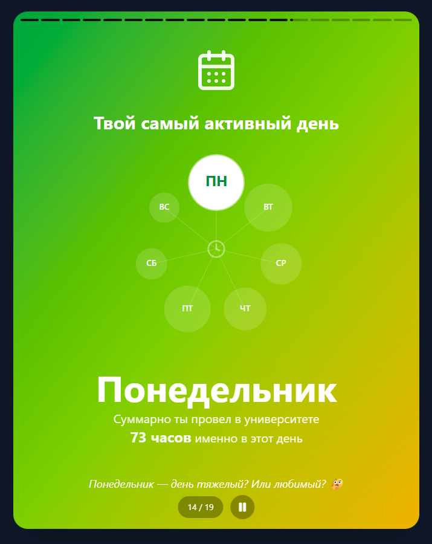

# osu-recap


Интерактивное веб-приложение для студентов ОГУ (Оренбургский Государственный Университет), создающее персональную статистику за учебный год в формате "историй", аналогично Spotify Wrapped.

Проект визуализирует учебные данные — посещаемость, оценки, время в университете — превращая сухие цифры в анимационную историю.



## Безопасность данных

Главный приоритет проекта — конфиденциальность ваших учетных данных. Архитектура приложения построена так, чтобы исключить возможность перехвата или сохранения логина и пароля.

**Почему это безопасно:**

1.  **Локальная обработка:** Ваши логин и пароль вводятся и используются **исключительно в вашем браузере**. Приложение работает как клиент, не имея собственного бэкенда для хранения данных.
2.  **Отсутствие базы данных:** Мы не сохраняем, не логируем и не анализируем ваши данные на сторонних серверах. Вся статистика генерируется "на лету" в оперативной памяти вашего устройства.
3.  **Открытый исходный код:** Весь код фронтенда находится в открытом доступе. Любой желающий может проверить, что именно делает приложение, и убедиться в отсутствии скрытых механизмов сбора данных.
4.  **Прозрачный транспорт:** Для связи с серверами университета используется прокси-сервер, который работает в режиме "трубы" — просто пересылает зашифрованные запросы, не имея технической возможности читать или сохранять их содержимое.

---

## Техническое описание архитектуры

Проект «OSU Recap» реализован как **Client-Side Application (SPA)** с использованием прозрачного проксирования для обхода CORS-ограничений. Бэкенд с бизнес-логикой отсутствует.

### 1. Frontend (React SPA)

*   **Хостинг:** GitHub Pages (статический хостинг).
*   **Сборка:** Выполняется автоматически через GitHub Actions из публичного репозитория. Это гарантирует, что код, который вы видите в репозитории, соответствует тому, что выполняется в браузере.
*   **Логика:** Вся бизнес-логика (парсинг HTML, расчет статистики, генерация анимаций) выполняется на клиенте.

### 2. Прокси (Yandex Cloud API Gateway)

Браузеры блокируют прямые запросы с одного домена (`github.io`) на другой (`osu.ru`) из-за политики CORS. Для обхода этого ограничения используется Yandex Cloud API Gateway в режиме прозрачного прокси.

**Характеристики прокси:**
*   **Декларативная конфигурация:** Прокси описан стандартом OpenAPI 3.0 и не содержит исполняемого кода (функций), который мог бы скрыто обрабатывать данные.
*   **Stateless:** Не имеет базы данных или кэша.
*   **Transparent:** Пересылает тело запроса, заголовки и параметры без изменений.

**Конфигурация шлюза (`gw.yaml`):**

```yaml
paths:
  /api/osu/{proxy+}:
    x-yc-apigateway-any-method:
      summary: Transparent proxy to osu.ru
      parameters:
        - name: proxy
          in: path
          required: true
          schema:
            type: string
      x-yc-apigateway-integration:
        type: http
        method: POST
        url: https://www.osu.ru/{proxy}
        path:
          proxy: proxy
        query:
          '*': '*'
        headers:
          Host: www.osu.ru
          '*': '*'
        body:
          '*': '*'
```

Как видно из конфигурации, шлюз выполняет простую переадресацию запросов на `https://www.osu.ru/{proxy}`, подменяя только заголовок `Host`.

### Модель угроз и защита

| Угроза | Защита |
| :--- | :--- |
| **Кража паролей сервером** | Сервера с бизнес-логикой не существует. Прокси декларативен и не умеет сохранять данные. |
| **Подмена кода** | Сборка и деплой автоматизированы через GitHub Actions. История изменений публична. |
| **Перехват трафика** | Все соединения (Браузер -> Прокси -> ОГУ) зашифрованы TLS. |

## Технологический стек

*   **Frontend:** React 18, TypeScript, Vite
*   **Styling:** Tailwind CSS
*   **UI Components:** Radix UI, shadcn/ui
*   **Animation:** Motion (Framer Motion)
*   **Infrastructure:** Yandex Cloud API Gateway (Serverless)

## Запуск проекта локально

Для запуска вам потребуется [Node.js](https://nodejs.org/).

1.  **Клонируйте репозиторий:**
    ```bash
    git clone https://github.com/osu-platform/osu-recap.git
    cd osu-recap
    ```

2.  **Установите зависимости:**
    ```bash
    npm install
    ```

3.  **Запустите режим разработки:**
    ```bash
    npm run dev
    ```

4.  **Сборка:**
    ```bash
    npm run build
    ```

## Лицензия

Проект распространяется под лицензией GNU General Public License v3.0 (GPL-3.0).
